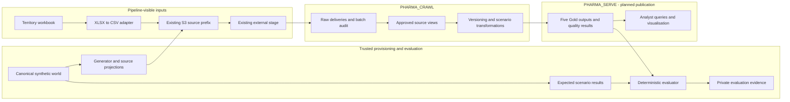

# Pharma commercial lab architecture

Last updated: **20 September 2026**  
Status: **Target architecture agreed in principle; local baseline implemented; cloud deployment and permissions not yet verified.**  
Repository: `mcgrath-bpt/pharma-commercial-lab`  
Baseline reviewed: `b2b940c`

## 1. Purpose and authority

The lab proves that guarded pipelines can turn synthetic commercial source data into five correct, explainable business datasets. One canonical fictional world produces imperfect Veeva CRM-like, IQVIA-like and Salesforce-like feeds. A separate evaluator holds the expected answers.

This document records the infrastructure, data and security boundaries for **phase two: Crawl** and **phase three: Walk**. The repository is the source of truth. Names below are logical deployment names consistent with the runbook, not a claim that these exact objects exist in an account.

Use [SCENARIOS.md](SCENARIOS.md) for business acceptance, [MODEL.md](MODEL.md) and the [canonical contract](../contracts/canonical-model.json) for data definitions, [DESIGN.md](DESIGN.md) for detailed trade-offs, and [RUNBOOK.md](RUNBOOK.md) for execution steps. The enterprise security boundaries recorded here supersede earlier suggestions that the engineering role could create schemas. Implementation gaps are listed in section 8; this document does not change executable code.

## 2. Infrastructure and deployment boundaries

The database, approved schemas, S3 location and external stage are assumed established by the platform team. A warehouse will be provided. Their actual names, permissions and connectivity remain deployment checks.

| Logical location | Responsibility | Access boundary | Delivery status |
|---|---|---|---|
| Existing S3 source prefix | Immutable synthetic deliveries, manifests and original business files | Approved uploader writes; pipeline reads | Local upload tree exists; remote delivery unverified |
| `LAB_DB.INGEST.EXISTING_S3_STAGE` | Existing reference to that S3 prefix | Platform-owned; engineer/runner receive approved access | Assumed established; binding unverified |
| `LAB_DB.PHARMA_CRAWL` | Raw tables, source views, transformations and operational records | Engineer-managed objects inside a platform-owned schema | Loading/reference SQL exists; cloud execution unverified |
| `LAB_DB.PHARMA_SERVE` | Persistent published outputs and business-facing views | Engineer publishes; analysts read | Target arrangement; publication not implemented |
| `LAB_EVAL_DB.SYNTH_TRUTH` | Canonical truth, expected results and private evaluation evidence | Separate truth maintainer and trusted evaluator | Optional cloud location; local evaluator already exists |
| `LAB_PHARMA_WH` | Loading, SQL transformations, queries and scheduled tasks | Workload roles receive `USAGE`; platform manages compute | Allocation and configuration to confirm |

Use existing approved equivalents for these locations. A separate evaluator database is preferred where database-wide access would otherwise expose truth. A separate schema in the same database is acceptable only after proving the same isolation across all inherited and secondary roles.

Two working schemas are sufficient: engineering workspace and publication. Separate Bronze/Silver/Gold databases are unnecessary for this pilot. A compute pool is not required. Generator, XLSX conversion and the agent/controller run outside Snowflake; the current database workload uses a warehouse. Container hosting is a later decision, not a prerequisite.

The platform team retains database/schema ownership, role administration, storage integrations, authentication, network controls and warehouse administration. Engineering creates and manages associated data objects only within its approved schemas. An existing enterprise scheduler and notification route may be reused.

### Target data flow and trust boundaries



The current reference implementation produces temporary Gold tables in its working session. The diagram shows the target persistent publication boundary. In this repository, **public** means pipeline-visible synthetic input, not internet-public data.

## 3. Data architecture

### Canonical world and projections

The 16 canonical entities are grouped below. Their keys, types, relationships and grains are defined in the model contract, rather than redefined here.

| Domain | Canonical entities |
|---|---|
| Customer reference | `HCP`, `HCO`, `AFFILIATION` |
| Product reference | `PRODUCT`, `PRODUCT_HIERARCHY` |
| Field organisation | `TERRITORY`, `REPRESENTATIVE`, `REP_TERRITORY`, `HCP_TERRITORY` |
| Engagement and preferences | `INTERACTION`, `INTERACTION_PRODUCT`, `CONSENT_EVENT` |
| Campaigns | `CAMPAIGN`, `CAMPAIGN_MEMBER` |
| Commercial measures | `RX_SALES` |
| Private identity evidence | `SOURCE_IDENTITY` |

The fixture contains no patients, real contact details or proprietary vendor layouts. HCP/HCO master attributes are current-state records in Crawl. Interaction versions, consent events, relationship intervals and product hierarchy intervals provide the temporal behaviour required by acceptance. Full bitemporal MDM is outside this phase.

| Information | Approved source in the lab | Integration rule |
|---|---|---|
| Active customers and speciality | IQVIA-like provider reference | Unique active provider is the approved customer |
| Interactions and discussed products | Veeva CRM-like activity and versioned details | Latest accepted source version; details replace the previous version's full detail set |
| Commercial email consent | Salesforce-like preferences | Latest effective event visible at the reporting cut-off |
| Current product hierarchy | IQVIA-like product reference | Resolve the hierarchy effective at the reporting cut-off |
| Campaigns and membership | Salesforce-like campaign feeds | Enrolled members of noncancelled campaigns |
| Territory assignment | Monthly mapping workbook, converted to CSV | Latest effective current assignment; conflicting equal-date assignments fail |

Public customer identities differ by source. Matching uses an exact nonblank synthetic token that resolves to one active approved provider. Missing or ambiguous evidence becomes an exception. The hidden crosswalk is never a pipeline input. Public product reference codes are deliberately shared across feeds in Crawl; more difficult product resolution belongs in Walk.

### Delivery and ingestion

Stage-relative files use this pattern:

```text
synthetic/pharma/<release_id>/
  sources/<source>/<entity>/batch=<batch_id>/part-00001.csv
  business_files/territory/territory_mapping_202609.xlsx
  control/<batch_id>.manifest.json
  control/<batch_id>.ready.json
  control/source-contracts.json
  control/territory-adapter.receipt.json
```

The delivered release has 15 source entities and 19 CSV files across two batches. [S3_LAYOUT.md](S3_LAYOUT.md) lists the concrete keys. The CSV/JSON generator is deterministic for a fixed configuration and implementation. The supplied XLSX is a static fixture with a tested converter.

1. Trusted provisioning creates the world and source projections. The adapter converts the territory workbook to the same CSV contract used by ingestion.
2. Local validation checks file headers, row counts, byte counts and SHA-256 fingerprints. The uploader refuses unlisted files and differing existing objects.
3. Upload data and contracts first, manifests next and ready markers last. Each ready marker identifies the manifest hash. These hashes provide integrity checks, not independent author authentication.
4. The loader selects explicit manifest file lists through the existing stage. Raw columns initially land as text so invalid business values remain inspectable.
5. Each raw table must pass its expected row-count check before the batch is exposed through source views. Stop execution on any SQL error.
6. Transform accepted source records, retain exceptions, compare the results and publish only after required gates succeed.

The current Python renderer validates the local delivery; the generated SQL does not independently authenticate remote manifests or recompute S3 SHA-256. There is no deployed ready-marker watcher. Direct/manual uploads are outside that validated delivery path until separately verified.

Raw deliveries are intended to be immutable and replayable. The current engineering privileges do not make raw tables tamper-proof. Use one loader in Crawl, then narrower runtime permissions and controlled recovery in Walk. File load history alone is not the permanent business replay ledger.

### Time, versions and business outputs

Keep business time (`occurred_at`, effective dates), source change time (`modified_at`, version) and observation time (manifest `available_at`) separate. Reports must not see deliveries or effective events after their cut-off. The pilot uses UTC and half-open date intervals: `[start, end)`. Blank end means open-ended.

Bootstrap admits the declared historical window. Later new interactions can arrive up to seven calendar days after occurrence; corrections and tombstones use their modification date. The seventh day is accepted, the eighth is rejected. Higher accepted source versions replace earlier state; identical replay is harmless and conflicting same-version payloads fail. A rejected correction must leave the last accepted state intact.

| Scenario | Published object in `PHARMA_SERVE` | Output grain / important rule |
|---|---|---|
| S1 engagement and consent | `GOLD_S01_ENGAGEMENT` | One eligible interaction; current granted consent filters historical activity |
| S2 product activity | `GOLD_S02_PRODUCT_ACTIVITY` | Customer/product/day; count distinct interactions and apply current hierarchy |
| S3 territory assignment | `GOLD_S03_CUSTOMER_TERRITORY` | One active approved customer; retain and flag missing territory |
| S4 trusted interactions | `GOLD_S04_INTERACTION` | Latest accepted nondeleted interaction; retains CRM customer IDs |
| S5 campaign reporting | `GOLD_S05_CAMPAIGN` | Campaign/customer; retain zero-contact members and count qualifying interactions |
| Quality evidence | `GOLD_DQ`, `GOLD_EXCEPTIONS` | Percentage checks plus explicit exclusions and exceptions |

S1, S2, S3 and S5 use the approved provider key. Consent is not an additional filter for S2 or S5. Product-level activity counts cannot be summed to infer distinct calls across products. Campaign contact counts do not establish causal effectiveness. Weekly prescription/sales observations and their restatements support the synthetic world but are not a sixth acceptance scenario.

Thresholds are strictly greater than 2% unmatched CRM interactions, 1% unknown-product interactions and 5% unmatched campaign members respectively. Exact boundaries pass; an empty denominator is `NO_DATA`. S3 missing assignments and S4 required-field failures appear in exceptions. Structural errors and unresolved conflicts block publication; expected business DQ alerts may accompany valid output. Exact denominators and filtering order remain in [SCENARIOS.md](SCENARIOS.md).

## 4. Security architecture

### Enterprise role boundary

`ROLE_ANALYST` is read-only on the data to which it is granted access, subject to RLS and masking. `ROLE_ENGINEER` may read/write associated data and create permitted data objects inside approved schemas. Neither the agent nor its engineering execution path may create schemas, create/amend roles, administer database/schema grants, modify integrations or administer row-access policies.

DBAs establish scoped access and its inheritance for existing and future objects. New local tables/views may be owned by the engineering deployment role; that does not require schema ownership. Prefer managed-access schemas so grant decisions remain with authorised platform administrators. There is no request for `ALL PRIVILEGES`, `WITH GRANT OPTION`, grant management or warehouse administration. [Snowflake access-control guidance](https://docs.snowflake.com/en/user-guide/security-access-control-considerations)

Privileges are additive: a narrow-looking role inheriting a broad `ROLE_ENGINEER` retains that broad access. Where necessary, compose agent permissions from existing scoped access roles. An agent role name alone cannot isolate truth. [Role hierarchy](https://docs.snowflake.com/en/user-guide/security-access-control-overview)

### Execution profiles

Names are illustrative permission profiles; reuse enterprise roles where possible. A skill or reasoning agent does not automatically require its own Snowflake role.

| Function | Illustrative profile | Allowed scope | Excluded scope |
|---|---|---|---|
| Requester, planner, reviewer | `ROLE_PHARMA_READER` | Approved catalogue metadata, samples, published outputs and operational summaries | Data mutation, deployment and truth |
| Builder/deployer | `ROLE_PHARMA_BUILDER` | Engineer-style DDL/DML in the two working schemas; approved source access | Database/schema/role administration, policy administration and truth |
| Scheduled execution | `ROLE_PHARMA_RUNNER` | Read sources; insert raw deliveries; required DML on state/output tables; approved procedure and warehouse usage | General table/view deployment and truth; task ownership limited to approved jobs |
| Trusted deterministic evaluation | `ROLE_PHARMA_EVALUATOR` | Read actual and expected results; insert evidence into designated private evaluation tables | Changing pipeline code, canonical data or expected answers |
| Truth maintenance | `ROLE_PHARMA_TRUTH_MAINTAINER` | Maintain canonical and expected data inside the private boundary | Routine pipeline building or execution |
| Operations observer | Existing reader profile initially | Read run/DQ summaries; scoped task monitoring if granted | Task operation unless separately authorised |

Builder, runner and evaluator use separate approved connection identities. Do not assign builder and evaluator access to one shared service principal and rely on its selected primary role. Authentication and credentials follow enterprise policy; no secrets belong in this repository.

The current maintainer repository contains truth, generator inputs, oracle code and expected results. **It is not the restricted workspace for an agent being evaluated.** That agent receives only public source inputs and acceptance contracts, without the full repository, Git history, evaluator credentials or private files. Snowflake isolation alone cannot protect answers already present on the agent's filesystem.

The evaluator is trusted software outside the general agent reasoning context. Detailed expected rows and evaluation evidence stay private; expose only approved summaries needed to diagnose failures. Builders must not be able to rewrite the evaluator's proof of correctness.

### Stage access, RLS and publication

The existing stage must not expose truth through a shared parent prefix. Stage access also permits reading source files outside table-level RLS, so its file scope must independently be appropriate for the workload. External-stage `USAGE` is not a read-only guarantee; the platform must confirm effective storage permissions and integration access. [Stage privileges](https://docs.snowflake.com/en/user-guide/security-access-control-privileges#stage-privileges)

Access grants do not themselves attach RLS or masking to newly materialised outputs. A publication object requiring protection must have its approved policy applied before readers can access it. Do not use future reader grants to expose an unprotected intermediate table. Prefer policy-protected backing tables and stable approved publication views where enterprise rules require that separation.

Test policy behaviour under the actual builder, analyst and task identities. `CURRENT_ROLE()` checks are not equivalent to hierarchy-aware `IS_ROLE_IN_SESSION()` checks. A role change must not be solved by granting a policy bypass. The evaluator must compare the intended entitlement slice; it should not interpret legitimate RLS filtering as a pipeline defect. [Row access policies](https://docs.snowflake.com/en/sql-reference/sql/create-row-access-policy)

## 5. Execution, publication and operations

### Phase two: working Crawl

Use the existing warehouse and an externally invoked, reviewed SQL/Python harness. Prove S2 and S4 end-to-end through S3 and the stage, then S3 through the workbook adapter. All five already have local reference outputs; no agent compiler is required to prove the hand-built baseline.

The current loader provides `LAB_CSV_V1`, 19 `RAW_B001_*`/`RAW_B002_*` tables, 15 `SRC_*` views, `LAB_BATCH_AUDIT` and `LAB_FILE_AUDIT`. Temporary transformations are suitable for the reference session. Durable analyst access requires implementing the `PHARMA_SERVE` publication contract.

Publication should build and validate a candidate result, then make the accepted run visible. Failed candidates must leave the last accepted result available. Multi-table publication needs a consistent run identifier or another reviewed visibility mechanism; sequential table replacement is not an atomic release. This publication control is planned, not provided by the current temporary-table reference.

### Phase three: scheduled and guarded Walk

| Proposed artefact | Responsibility |
|---|---|
| `PHARMA_CRAWL.LAB_SOURCE_REGISTRY` | Resolve contracts only to approved source objects |
| `PHARMA_CRAWL.LAB_RELEASE` | Record contract version, data release, code commit and implementation version |
| `PHARMA_CRAWL.LAB_PIPELINE_RUN` | Record run ID, cut-off, input batches, query IDs, timings, status and publication outcome |
| `PHARMA_CRAWL.SP_LOAD_BATCH`, `SP_BUILD_GOLD`, `SP_CHECK_DQ` | Reviewed execution procedures; bounded inputs and approved object names |
| `PHARMA_CRAWL.TASK_PHARMA_DAILY`, `TASK_PHARMA_WEEKLY` | Optional native scheduling using the provided warehouse |
| `SYNTH_TRUTH.LAB_EVAL_RUN`, `LAB_EVAL_RESULT` | Private, evaluator-written reconciliation evidence |

Prefer caller's rights for pipeline procedures so execution stays within the caller's permitted access. Owner's rights require a specific reviewed delegation, especially where RLS is involved. [Procedure execution rights](https://docs.snowflake.com/en/developer-guide/stored-procedure/stored-procedures-rights)

For native tasks, DBAs provide the chosen task owner with schema-scoped `CREATE TASK`, warehouse `USAGE`, necessary data/procedure access and account-level `EXECUTE TASK`. The last privilege enables execution, not account administration. Warehouse-backed tasks do not need the additional serverless-task permission. Validate policies in the task's actual execution context. [Task privileges](https://docs.snowflake.com/en/sql-reference/sql/create-task)

An existing enterprise scheduler is an acceptable alternative. Notifications should use the enterprise route where possible; a native notification integration is a separate DBA request only if selected. Add stream-based state or persistent incremental processing after proving equivalence to full recomputation. Materialised views, dynamic tables, Snowpipe, compute pools and native AI services are not prerequisites.

Operational acceptance includes fresh required deliveries, S2 publication by 06:30 UTC, S1 by 07:00 UTC, and weekly Monday S5 execution with a deadline still to be agreed. Capture real timings and notification evidence. Run and release IDs should be recorded alongside query IDs; an explicit query tag is useful for tracing workload cost. The platform sets warehouse limits and suspension behaviour.

## 6. Verification and release evidence

The reviewed baseline has 16 passing local tests, 16 canonical datasets, and all five scenarios plus exceptions/DQ matching at both checkpoints. See [VALIDATION.md](VALIDATION.md) and the [validation report](../evidence/validation-report.json). Local tests do not establish S3 delivery, Snowflake SQL execution, permission isolation, RLS correctness, scheduling or operational SLAs.

Cloud acceptance must establish:

- Exact result reconciliation against private expected rows, including duplicate multiplicity and exception/DQ outcomes.
- Identical replay, rejected late/corrupt delivery, retained trusted state and recovery without silent data loss.
- Analyst reads succeed and mutations fail; engineering work inside the boundary succeeds and administration outside it fails.
- Builder/runner/analyst principals cannot reach truth through Snowflake, S3, role inheritance, local files or Git access.
- Required RLS behaviour is preserved through materialisation, publication and scheduled execution.
- A failed pipeline cannot publish a partial result or overwrite private evaluation evidence.

Git is the code/documentation authority. A deployment should record the actual commit SHA plus immutable data/contract fingerprints in its run evidence. The current release manifest still has pre-commit metadata; linking deployment evidence to Git remains open. Do not equate a committed repository with a deployed or operationally accepted release.

## 7. DBA handover boundary

The initial DBA request is to confirm the existing containers and stage scope, warehouse access, scoped object creation/DML, existing/future access inheritance, object ownership, approved policy publication and separate service identities. DBAs retain role/grant administration at and above schema level.

Engineering then deploys the permitted file formats, tables, views and later procedures inside those boundaries. It does not request a DBA ticket for each raw table. Optional task execution and notification permissions are the phase-three increment. A protected local evaluator is sufficient until an approved private Snowflake location is available.

## 8. Implementation gaps and decisions still to confirm

These items extend the [working backlog](../TODO.md); none is represented as already deployed.

| Item | Required action | Responsibility |
|---|---|---|
| Schema creation in supplied code | Remove `CREATE SCHEMA` from `src/render_sql.py`, `src/model.py` and generated SQL; the private hydration path consumes that DDL. Use existing schemas only. | Engineering; before cloud execution |
| Earlier runbook wording | Replace the request for permission to create a schema and make the existing-schema prerequisite explicit. Follow this architecture boundary meanwhile. | Engineering |
| Temporary Gold outputs | Add persistent, policy-aware publication in `PHARMA_SERVE` and adapt the execution/export harness. | Engineering |
| Actual infrastructure binding | Confirm DB/schema/stage/S3/warehouse names, stage-owner integration permissions and connectivity. | Platform/DBA |
| Scoped roles and protected truth | Confirm actual role hierarchy, existing/future grants, managed-access suitability and separate principals. | Platform/DBA |
| Publication protection | Agree policy attachment and safe reader exposure for generated outputs; validate actual role/task contexts. | Platform/DBA and engineering |
| Business defaults | Confirm UTC, cut-offs, current-consent/current-hierarchy behaviour and weekly campaign-to-date reporting. | Business owner |
| Scheduling and operations | Choose scheduler and notification route; implement run/release evidence, consistent publication and recovery. | Engineering with platform support |
| Evaluation scope | Pin private expected results to release, cut-off and applicable entitlements; keep feedback within the approved boundary. | Evaluator maintainer |

Post-pilot work includes production promotion/recovery automation, larger-volume performance testing, more difficult identity/source evolution, and catalogue/ITSM integration when justified by an accepted scenario. Patient data, general event-sourced MDM and causal campaign measurement remain outside the current scope.
