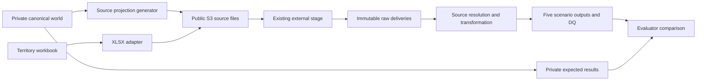

# Design, assumptions and critique

## Work backwards from the existing stage

1. A consumer needs one of the five precisely defined scenario outputs and its DQ evidence.
2. To prove correctness, an evaluator needs known expected rows for the same reporting cut-off and observed deliveries.
3. The pipeline needs typed source records, stable keys, delivered versions and explicit reference authority.
4. Snowflake needs immutable files loaded through the existing external stage, with whole-batch visibility controlled separately from individual COPY operations.
5. S3 needs exact object keys, complete delivery manifests, file fingerprints and a ready marker published last.
6. Those files must come from one canonical synthetic world with deliberate, recorded distortions.

An external stage is a storage reference. Its existence does not imply files have been uploaded, tables exist, privileges are sufficient, a pipeline is running or a deadline is met. Those are separate acceptance checks.

## Canonical truth is an evaluation asset

The canonical model is the generator's internal representation. It is **not** a privileged crosswalk handed to the pipeline. Public HCP, HCO, product, territory, rep, interaction and campaign IDs are distinct opaque values per system; public matching uses a fictional identifier token supplied as ordinary source evidence. Auxiliary event/assignment/membership keys use simple synthetic record labels.

The pipeline's published customer key is the IQVIA-like approved provider key. S4 intentionally retains the CRM customer key because it tests faithful interaction-feed processing before identity resolution. Canonical HCP IDs never appear in public scenario outputs.

The full maintainer pack contains both public and private files so a human can develop the lab. **Folder names do not enforce secrecy.** Give a builder only the public source bundle and acceptance contracts. Keep generator seed/inputs, canonical rows, projection decisions, oracle and expected rows in a different evaluator workspace and storage boundary. If the existing stage grants access to a parent S3 prefix, do not place truth anywhere beneath that accessible prefix. Use a separate bucket or prefix outside that stage's accessible scope and a separate evaluator role. Validate effective privileges, including inherited roles. We have not performed that environment check.

## Three different clocks

| Clock | Example field | Meaning |
|---|---|---|
| Business time | `occurred_at`, `effective_from` | When the interaction or relationship happened |
| Source change time | `modified_at`, `sequence_no` | When a correction became a new source version |
| Observation time | Manifest `available_at` | When this delivery became available to the pipeline |

All fixture timestamps and deadlines use **UTC**. This is a pilot assumption, not an inference about your production market or personal location. Date intervals are half-open: `[effective_from, effective_to)`. Blank end means no planned end. Future-effective rows are ignored until effective. Reports see only deliveries available by their reporting cut-off. A later delivery may restate an earlier business date; an earlier cut-off must not see it.

The world is temporal where the scenarios require it: interaction versions, consent events, territory/affiliation intervals and product hierarchy intervals. HCP and HCO attributes are current master records in Crawl. This is **not** a general event-sourced simulation or a complete bitemporal MDM model. Building those now would add complexity without proving these acceptance targets.

## Source authority and identity

| Domain | Approved source in this lab | Competing representation |
|---|---|---|
| Active customer and speciality | IQVIA-like provider reference | CRM and Salesforce labels |
| Interaction status, version, time and details | Veeva CRM-like activity feed | None |
| Consent for commercial email | Salesforce-like preferences | None |
| Current product hierarchy | IQVIA-like product reference | CRM carries product reference codes |
| Campaign and membership | Salesforce-like campaign feed | None |
| Current territory assignment | Monthly business mapping | Veeva-like territory code reference |

Exact nonblank token equality against one active approved customer is the only approved identity rule. No fuzzy matching, name-based guessing or arbitrary first match. Ambiguous/missing tokens become unmatched exceptions. Some source records deliberately lack tokens even though the evaluator knows the identity. Do not silently reward the pipeline for inventing a match.

This makes Crawl a test of source resolution, joins and handling uncertainty. It does **not** establish that an enterprise identity-resolution solution works. Public synthetic names remain highly regular; realistic identity challenge sets belong in Walk.

## Grain and accounting choices

An interaction may discuss several products. Its details belong to the **interaction version**, not just to the interaction ID. A corrected version completely replaces that interaction's detail set. Joining old and new detail rows together would retain obsolete products and inflate counts.

S2 counts distinct interactions per customer/product/day. A multi-product call contributes once to each discussed product. Summing S2 across products is therefore not a distinct-call total. Minutes are retained in S4 but are not repeated and summed at product grain.

S5 counts distinct qualifying interactions and retains zero-contact members. Its contact counts describe activity during a campaign window. They do **not** measure incremental campaign effectiveness, causal lift, prescriptions caused by a campaign or return on investment. The original scenario name is retained, but those stronger claims would need a different design.

Weekly Rx and sales counts are supporting aggregate observations. A corrected observation replaces its earlier version. Do not add the two versions. Rx counts and sales units are distinct measures, and no currency or market-share denominator is invented.

## Strong objections to tempting shortcuts

| Shortcut | Why it is wrong | Crawl decision |
|---|---|---|
| Generate three unrelated random source files | There is no independent integrated answer | Generate one world, then project it |
| Publish the full canonical crosswalk | It removes the identity problem and leaks answers | Publish limited token evidence; isolate truth |
| Treat the latest record as the latest arrival | A stale resend can undo a correction | Order by source version, reject conflicting same-version payloads |
| Apply the seven-day limit to the original date of every correction | It discards legitimate corrections to older business events | New events use occurred date; corrections use modification date |
| Always use current consent without stating the consequence | It can change eligibility for historical engagement rows | S1 is a current permitted-engagement view; history restates after withdrawal |
| Pick an arbitrary territory when effective dates tie | It hides a business conflict behind a deterministic sort | Equal latest dates with different territories fail the run |
| Treat an alert as permission to drop a delivery silently | Missing data can look clean | Record exclusions and alert counts; hard conflicts block publication |
| Treat PK/FK DDL as a data quality engine | Standard Snowflake table constraints do not enforce all key relationships | Explicit local and cloud assertions |
| Rely on COPY history as the permanent ledger | Load metadata expires; renamed files can duplicate payloads | Immutable keys, manifests, audit tables and version-level deduplication |
| Claim an SLA from synthetic timestamps | No scheduler, runtime or notification has been demonstrated | Keep SLA acceptance open until timed cloud runs succeed |

## Publication and failure behaviour

Files use immutable release/batch keys. A ready marker contains the SHA-256 of the manifest. The uploader validates local file bytes and uses conditional S3 puts, refusing to replace existing different objects. Data and source contracts upload before manifests; ready markers upload last.

The Snowflake loader uses explicit `FILES`, never a broad pattern over the entire stage. Raw tables are isolated by batch and source entity. Columns land as text so deliberately invalid business values remain inspectable. File shape errors abort COPY. Every loaded table must match its manifest count before the batch audit row becomes visible to source views. SQL clients must stop on the first error. There is one loader in Crawl; the audit tables are not a concurrent lock service.

The manifest validation and uploader are responsible for byte fingerprints and headers. Snowflake's raw row count gate does not re-compute S3 SHA-256 or prove headers; uploading outside the supplied path breaks that chain. Inherited bucket permissions, KMS permissions and stage URL scope still need real verification.

The local reference and Snowflake hand implementation recompute scenario outputs from accepted source versions. This proves incremental **semantics** with replayable deliveries. It is not yet an efficient persistent incremental MERGE pipeline. In Walk, add durable state only after proving it gives exactly the same result as this baseline.

## Defaults to confirm during deployment

These are adopted defaults so the pack is executable; changing them should create a new contract version and new truth sets:

- UTC reporting dates and deadlines; daily reporting cut-off at 06:00 UTC.
- S1 commercial EMAIL scope and current consent at the run cut-off; missing consent is excluded.
- Active approved customers for S1, S2, S3 and S5.
- S2 current hierarchy restates older activity rows.
- S4 seven calendar days, inclusive; source corrections must be labelled with a higher source version.
- S5 weekly Monday reporting of campaign-to-date activity, with campaign end exclusive. The supplied Tuesday cut-off is an additional regression checkpoint, not a claimed scheduled weekly run.
- DQ alerts do not block publication; structural/schema errors, equal-version conflicts and unresolved territory ties do. S3 missing territory is flagged but retained.

These choices are meaningful product decisions. The five original sentences did not settle them.

## Technical sources checked on 19 September 2026

- [Snowflake COPY syntax and exact file loading](https://docs.snowflake.com/en/sql-reference/sql/copy-into-table)
- [Supported load formats](https://docs.snowflake.com/en/user-guide/data-load-prepare): XLSX requires an adapter.
- [Load-history expiry](https://docs.snowflake.com/en/user-guide/data-load-considerations-load): the documentation describes a 64-day metadata window.
- [Constraint behaviour](https://docs.snowflake.com/en/sql-reference/constraints-overview)
- [Nondeterministic MERGE behaviour](https://docs.snowflake.com/en/sql-reference/sql/merge)
- [S3 conditional puts](https://docs.aws.amazon.com/cli/latest/reference/s3api/put-object.html)

The source-system layouts in this pack are our own synthetic contracts. They are not claims about the current schemas of commercial Veeva, IQVIA or Salesforce products.
