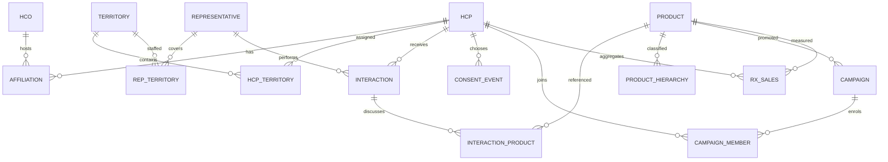

# Canonical model and source projections

The canonical model has 16 entities. It adds product hierarchy intervals and rep–territory relationships to the original compact entity set. These remain evaluator/generator records, with separate public source dialects. All PK and FK assertions are checked locally. Snowflake DDL is supplied but cloud execution remains open.

## Relationship map

Interaction cardinalities apply to versioned records. Product details reference `(interaction_id, version_no)`. A logical interaction therefore has several version rows. `SOURCE_IDENTITY` is a private polymorphic crosswalk to HCP, HCO, product, territory, representative, interaction and campaign IDs. IDs are not reused in Crawl.

## Entity dictionary

### HCP

one fictional professional.

Primary key: `hcp_id`.

| Field | Type | Nullable | Reference |
|---|---|---|---|
| `hcp_id` | VARCHAR | no |  |
| `display_name` | VARCHAR | no |  |
| `speciality` | VARCHAR | no |  |
| `country` | VARCHAR | no |  |
| `postal_sector` | VARCHAR | no |  |
| `active` | BOOLEAN | no |  |

### HCO

one fictional organisation.

Primary key: `hco_id`.

| Field | Type | Nullable | Reference |
|---|---|---|---|
| `hco_id` | VARCHAR | no |  |
| `organisation_name` | VARCHAR | no |  |
| `country` | VARCHAR | no |  |

### AFFILIATION

one HCP–HCO relationship interval.

Primary key: `affiliation_id`.

| Field | Type | Nullable | Reference |
|---|---|---|---|
| `affiliation_id` | VARCHAR | no |  |
| `hcp_id` | VARCHAR | no | hcp.hcp_id |
| `hco_id` | VARCHAR | no | hco.hco_id |
| `relationship_type` | VARCHAR | no |  |
| `is_primary` | BOOLEAN | no |  |
| `effective_from` | DATE | no |  |
| `effective_to` | DATE | yes |  |

### PRODUCT

one fictional marketed product.

Primary key: `product_id`.

| Field | Type | Nullable | Reference |
|---|---|---|---|
| `product_id` | VARCHAR | no |  |
| `product_name` | VARCHAR | no |  |
| `active` | BOOLEAN | no |  |

### PRODUCT_HIERARCHY

one product hierarchy interval.

Primary key: `product_id, effective_from`.

| Field | Type | Nullable | Reference |
|---|---|---|---|
| `product_id` | VARCHAR | no | product.product_id |
| `effective_from` | DATE | no |  |
| `effective_to` | DATE | yes |  |
| `brand` | VARCHAR | no |  |
| `therapy` | VARCHAR | no |  |

### TERRITORY

one territory.

Primary key: `territory_id`.

| Field | Type | Nullable | Reference |
|---|---|---|---|
| `territory_id` | VARCHAR | no |  |
| `territory_name` | VARCHAR | no |  |

### REPRESENTATIVE

one fictional representative.

Primary key: `rep_id`.

| Field | Type | Nullable | Reference |
|---|---|---|---|
| `rep_id` | VARCHAR | no |  |
| `rep_name` | VARCHAR | no |  |

### REP_TERRITORY

one rep–territory interval.

Primary key: `rep_id, territory_id, effective_from`.

| Field | Type | Nullable | Reference |
|---|---|---|---|
| `rep_id` | VARCHAR | no | representative.rep_id |
| `territory_id` | VARCHAR | no | territory.territory_id |
| `effective_from` | DATE | no |  |
| `effective_to` | DATE | yes |  |

### HCP_TERRITORY

one assignment interval; latest effective wins, equal-date conflict fails.

Primary key: `assignment_id`.

| Field | Type | Nullable | Reference |
|---|---|---|---|
| `assignment_id` | VARCHAR | no |  |
| `hcp_id` | VARCHAR | no | hcp.hcp_id |
| `territory_id` | VARCHAR | no | territory.territory_id |
| `effective_from` | DATE | no |  |
| `effective_to` | DATE | yes |  |

### INTERACTION

one interaction version, including tombstones.

Primary key: `interaction_id, version_no`.

| Field | Type | Nullable | Reference |
|---|---|---|---|
| `interaction_id` | VARCHAR | no |  |
| `version_no` | NUMBER | no |  |
| `hcp_id` | VARCHAR | no | hcp.hcp_id |
| `rep_id` | VARCHAR | no | representative.rep_id |
| `primary_product_id` | VARCHAR | no | product.product_id |
| `occurred_at` | TIMESTAMP_NTZ | no |  |
| `channel` | VARCHAR | no |  |
| `approval` | VARCHAR | no |  |
| `duration_minutes` | NUMBER | no |  |
| `modified_at` | TIMESTAMP_NTZ | no |  |
| `operation` | VARCHAR | no |  |
| `delivery_batch` | VARCHAR | no |  |

### INTERACTION_PRODUCT

one product per interaction version; complete detail replacement.

Primary key: `interaction_id, version_no, product_id`.

| Field | Type | Nullable | Reference |
|---|---|---|---|
| `interaction_id` | VARCHAR | no |  |
| `version_no` | NUMBER | no |  |
| `product_id` | VARCHAR | no | product.product_id |
| `detail_rank` | NUMBER | no |  |

### CONSENT_EVENT

one preference event for HCP/channel/purpose.

Primary key: `consent_id`.

| Field | Type | Nullable | Reference |
|---|---|---|---|
| `consent_id` | VARCHAR | no |  |
| `hcp_id` | VARCHAR | no | hcp.hcp_id |
| `channel` | VARCHAR | no |  |
| `purpose` | VARCHAR | no |  |
| `status` | VARCHAR | no |  |
| `effective_at` | TIMESTAMP_NTZ | no |  |
| `sequence_no` | NUMBER | no |  |
| `delivery_batch` | VARCHAR | no |  |

### CAMPAIGN

one single-product campaign.

Primary key: `campaign_id`.

| Field | Type | Nullable | Reference |
|---|---|---|---|
| `campaign_id` | VARCHAR | no |  |
| `product_id` | VARCHAR | no | product.product_id |
| `start_date` | DATE | no |  |
| `end_date_exclusive` | DATE | no |  |
| `status` | VARCHAR | no |  |

### CAMPAIGN_MEMBER

one campaign membership; campaign/HCP unique.

Primary key: `membership_id`.

| Field | Type | Nullable | Reference |
|---|---|---|---|
| `membership_id` | VARCHAR | no |  |
| `campaign_id` | VARCHAR | no | campaign.campaign_id |
| `hcp_id` | VARCHAR | no | hcp.hcp_id |
| `member_status` | VARCHAR | no |  |

### RX_SALES

one weekly HCP/product commercial observation version; no patient data.

Primary key: `observation_id, version_no`.

| Field | Type | Nullable | Reference |
|---|---|---|---|
| `observation_id` | VARCHAR | no |  |
| `version_no` | NUMBER | no |  |
| `hcp_id` | VARCHAR | no | hcp.hcp_id |
| `product_id` | VARCHAR | no | product.product_id |
| `week_ending` | DATE | no |  |
| `trx_count` | NUMBER | no |  |
| `nrx_count` | NUMBER | no |  |
| `sales_units` | NUMBER | no |  |

### SOURCE_IDENTITY

one hidden canonical-to-source identity; crawl IDs never reused.

Primary key: `entity_type, source, source_id`.

| Field | Type | Nullable | Reference |
|---|---|---|---|
| `entity_type` | VARCHAR | no |  |
| `canonical_id` | VARCHAR | no |  |
| `source` | VARCHAR | no |  |
| `source_id` | VARCHAR | no |  |
| `link_token` | VARCHAR | no |  |

## Source projections

All source columns land as VARCHAR; logical types are declared in the source contracts and validated during transformation. Empty CSV fields represent null. Public IDs are not canonical IDs. Public contract keys describe the intended logical grain; the fixture deliberately contains an exact activity duplicate.

### iqvia_like/affiliation

Canonical entity: affiliation. Key: `affiliation_key`. Scenarios: supporting world only. Delivery: initial snapshot plus explicit event/interval history.

| Source field | Logical type | Projection |
|---|---|---|
| `affiliation_key` | TEXT | affiliation_id |
| `provider_key` | TEXT | hcp_id through IQVIA identity |
| `organisation_key` | TEXT | hco_id through IQVIA identity |
| `relationship_type` | TEXT | relationship_type |
| `is_primary` | BOOLEAN | is_primary |
| `effective_from` | DATE | effective_from |
| `effective_to` | DATE | effective_to |

### iqvia_like/organisation

Canonical entity: hco. Key: `organisation_key`. Scenarios: supporting world only. Delivery: initial snapshot plus explicit event/interval history.

| Source field | Logical type | Projection |
|---|---|---|
| `organisation_key` | TEXT | hco_id through IQVIA identity |
| `organisation_name` | TEXT | organisation_name |
| `country` | TEXT | country |

### iqvia_like/product

Canonical entity: product + product_hierarchy. Key: `product_code, valid_from`. Scenarios: S02, S05. Delivery: initial snapshot plus explicit event/interval history.

| Source field | Logical type | Projection |
|---|---|---|
| `product_code` | TEXT | product_id through IQVIA identity |
| `brand` | TEXT | product_hierarchy.brand |
| `therapy` | TEXT | product_hierarchy.therapy |
| `valid_from` | DATE | effective_from |
| `valid_to` | DATE | effective_to |
| `active` | BOOLEAN | product.active |

### iqvia_like/provider

Canonical entity: hcp. Key: `provider_key`. Scenarios: S01, S02, S03, S05. Delivery: initial snapshot plus explicit event/interval history.

| Source field | Logical type | Projection |
|---|---|---|
| `provider_key` | TEXT | hcp_id through hidden IQVIA identity |
| `link_token` | TEXT | synthetic public matching evidence |
| `label` | TEXT | display_name |
| `speciality` | TEXT | speciality |
| `active` | BOOLEAN | active |
| `country` | TEXT | country |
| `postal_sector` | TEXT | postal_sector |

### iqvia_like/rx_weekly

Canonical entity: rx_sales. Key: `observation_key, version_no`. Scenarios: supporting world only. Delivery: versioned append.

| Source field | Logical type | Projection |
|---|---|---|
| `observation_key` | TEXT | observation_id |
| `provider_key` | TEXT | hcp_id through IQVIA identity |
| `product_code` | TEXT | product_id through IQVIA identity |
| `week_ending` | DATE | week_ending (Sunday) |
| `trx_count` | INTEGER | total synthetic prescription count |
| `nrx_count` | INTEGER | new synthetic prescription count; <= trx_count |
| `sales_units` | INTEGER | synthetic commercial units; not currency |
| `version_no` | INTEGER | source replacement version |

### manual/territory_mapping

Canonical entity: hcp_territory. Key: `assignment_key`. Scenarios: S03. Delivery: initial snapshot plus explicit event/interval history.

| Source field | Logical type | Projection |
|---|---|---|
| `assignment_key` | TEXT | assignment_id |
| `provider_key` | TEXT | hcp_id through IQVIA identity |
| `territory_code` | TEXT | territory_id through Veeva identity |
| `effective_from` | DATE | inclusive interval start |
| `effective_to` | DATE | exclusive interval end; blank=open |

### salesforce_like/campaign

Canonical entity: campaign. Key: `campaign_key`. Scenarios: S05. Delivery: initial snapshot plus explicit event/interval history.

| Source field | Logical type | Projection |
|---|---|---|
| `campaign_key` | TEXT | campaign_id through Salesforce identity |
| `product_code` | TEXT | product_id through IQVIA identity |
| `start_date` | DATE | start_date inclusive |
| `end_date_exclusive` | DATE | campaign end exclusive |
| `status` | TEXT | ACTIVE or CANCELLED |

### salesforce_like/campaign_member

Canonical entity: campaign_member. Key: `membership_key`. Scenarios: S05. Delivery: initial snapshot plus explicit event/interval history.

| Source field | Logical type | Projection |
|---|---|---|
| `membership_key` | TEXT | membership_id |
| `campaign_key` | TEXT | campaign_id through Salesforce identity |
| `contact_key` | TEXT | hcp_id through Salesforce identity |
| `member_status` | TEXT | ENROLLED in Crawl |

### salesforce_like/consent

Canonical entity: consent_event. Key: `preference_key`. Scenarios: S01. Delivery: initial snapshot plus explicit event/interval history.

| Source field | Logical type | Projection |
|---|---|---|
| `preference_key` | TEXT | consent_id |
| `contact_key` | TEXT | hcp_id through Salesforce identity |
| `channel` | TEXT | EMAIL in Crawl |
| `purpose` | TEXT | COMMERCIAL in Crawl |
| `status` | TEXT | GRANTED or WITHDRAWN; unknown status excluded |
| `effective_at` | TIMESTAMP_UTC | effective_at |
| `sequence_no` | INTEGER | business event tie-breaker |

### salesforce_like/contact

Canonical entity: hcp. Key: `contact_key`. Scenarios: S01, S05. Delivery: initial snapshot plus explicit event/interval history.

| Source field | Logical type | Projection |
|---|---|---|
| `contact_key` | TEXT | hcp_id through Salesforce identity |
| `match_token` | TEXT | public token or deliberately missing evidence |
| `display_name` | TEXT | abbreviated synthetic display_name |

### veeva_like/activity

Canonical entity: interaction. Key: `activity_key, source_version`. Scenarios: S01, S02, S04, S05. Delivery: versioned append.

| Source field | Logical type | Projection |
|---|---|---|
| `activity_key` | TEXT | interaction_id through Veeva identity |
| `customer_key` | TEXT | hcp_id through Veeva identity |
| `primary_product_code` | TEXT | primary_product_id through IQVIA identity, with deliberate unknown codes |
| `occurred_at` | TIMESTAMP_UTC | occurred_at, with deliberate missing-value fixture |
| `channel` | TEXT | channel |
| `approval` | TEXT | approval |
| `duration_minutes` | INTEGER | duration_minutes |
| `source_version` | INTEGER | version_no |
| `modified_at` | TIMESTAMP_UTC | modified_at |
| `operation` | TEXT | UPSERT or DELETE |

### veeva_like/activity_product

Canonical entity: interaction_product. Key: `activity_key, source_version, product_code`. Scenarios: S02, S05. Delivery: versioned append.

| Source field | Logical type | Projection |
|---|---|---|
| `activity_key` | TEXT | interaction_id through Veeva identity |
| `source_version` | INTEGER | version_no; full detail set for each activity version |
| `product_code` | TEXT | product_id through IQVIA identity or unknown-code defect |
| `detail_rank` | INTEGER | detail_rank |

### veeva_like/customer

Canonical entity: hcp. Key: `customer_key`. Scenarios: S01, S02, S05. Delivery: initial snapshot plus explicit event/interval history.

| Source field | Logical type | Projection |
|---|---|---|
| `customer_key` | TEXT | hcp_id through Veeva identity |
| `match_token` | TEXT | public token or deliberately missing evidence |
| `display_name` | TEXT | uppercase synthetic display_name |
| `active` | BOOLEAN | source active flag; approved master remains authoritative |

### veeva_like/staff

Canonical entity: representative. Key: `staff_key`. Scenarios: supporting world only. Delivery: initial snapshot plus explicit event/interval history.

| Source field | Logical type | Projection |
|---|---|---|
| `staff_key` | TEXT | rep_id through Veeva identity |
| `staff_name` | TEXT | rep_name |

### veeva_like/territory

Canonical entity: territory. Key: `territory_code`. Scenarios: S03. Delivery: initial snapshot plus explicit event/interval history.

| Source field | Logical type | Projection |
|---|---|---|
| `territory_code` | TEXT | territory_id through Veeva identity |
| `territory_name` | TEXT | territory_name |

## Intentionally limited projection coverage

The canonical `rep_territory` relationship is hydrated privately but has no public extract in Crawl because none of the five outputs requires rep coverage. Likewise, activity rep identity is held canonically but is not included in the minimal public activity layout. Add those public fields only when a scenario requires them. Supporting HCO, affiliation, staff and Rx extracts are supplied to make the universe extensible; they do not increase acceptance coverage by themselves.

Product uses a shared public IQVIA-like reference code across activity and campaigns. This is an explicit approved product cross-reference convention, not an assertion that real vendor systems naturally share product identifiers. Distinct product dialects and ambiguous crosswalks are Walk work.
